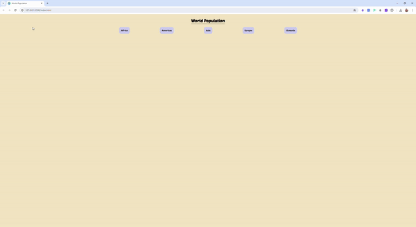

# World Population Web App 

Welcome to the World Population Web App! This JavaScript-based application is designed to help users explore population data from around the world. Built on the module design pattern, it provides an intuitive interface for visualizing population statistics by continent, country, and city.

## Features

- **Interactive UI:** Click on continent buttons to discover population data for each continent.
- **Population Charts:** Dynamic charts display population statistics for countries and cities.
- **Loader:** A loader element indicates when data is being fetched from APIs, enhancing user experience.
- **Error Handling:** Graceful error messages are displayed to users if API requests fail, ensuring smooth interaction.

## Installation

To run the World Population Web App locally, follow these steps:

1. Clone the repository:

   git clone https://github.com/DanielYehezkely/world-population-JS

2. Navigate to the project directory:

   cd world-population

3. Open `index.html` in your web browser.

## Usage

1. **Continent Selection:** Simply click on a continent button to view population data for countries within that continent.
2. **Country Exploration:** After selecting a continent, click on a country button to explore population data for cities within that country.

## Built With

- **JavaScript:** <i class="fab fa-js"></i> The core programming language used for the application logic. JavaScript enables dynamic interactions and data manipulation, allowing for real-time population data visualization.
- **HTML:** <i class="fab fa-html5"></i> Structure and layout of the web pages. HTML provides the foundation for creating the user interface elements and content structure.
- **CSS:** <i class="fab fa-css3-alt"></i> Styling and visual presentation of the user interface. CSS is used to enhance the design and user experience by applying styles to HTML elements.
- **Chart.js:** <i class="fas fa-chart-line"></i> A popular JavaScript library for creating dynamic and interactive charts. Chart.js is utilized to generate visually appealing population charts and graphs, enhancing data visualization capabilities.

## Live Demo

[View Live Demo At Netlify](https://dyz-world-population-js.netlify.app/) 

